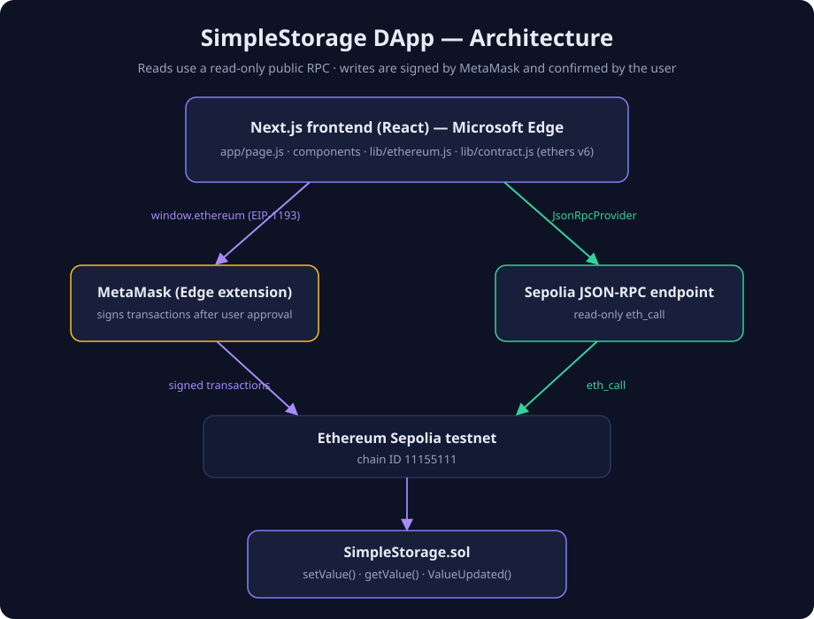

# Ethereum Sepolia DApp


A minimal but complete full-stack DApp: a **SimpleStorage** Solidity contract deployed to the
**Ethereum Sepolia testnet**, with a **Next.js** frontend that connects to **MetaMask in Microsoft
Edge** using **ethers v6** — read the stored value, submit a transaction to update it, and watch
the confirmation status live.

> **Testnet only.** All transactions run on Ethereum Sepolia and use test ETH with no real value.

## Overview

1. Open the website in Microsoft Edge.
2. Connect MetaMask (the app never switches networks without your approval).
3. See the connected wallet address, network and balance.
4. Read the value stored in the `SimpleStorage` contract (works even before connecting).
5. Enter a new value and send the `setValue()` transaction.
6. Confirm the transaction in MetaMask.
7. Follow the transaction status (awaiting approval → pending → confirmed) with the tx hash and an
   Etherscan link.
8. See the updated blockchain data.

## Architecture



```
Microsoft Edge
└─ Next.js frontend (React 19)
   ├─ reads : JsonRpcProvider ──► Sepolia RPC ──► SimpleStorage (read-only, no wallet needed)
   └─ writes: window.ethereum  ──► MetaMask    ──► signed tx ──► Sepolia ──► SimpleStorage
```

- **Reads** go through a read-only JSON-RPC provider, so the stored value is visible even before a
  wallet is connected.
- **Writes** go through the EIP-1193 injected provider (`window.ethereum`) → `BrowserProvider` →
  signer → `Contract`, and always require explicit approval in MetaMask.

## Tech Stack

| Layer             | Technology                                              |
| ----------------- | ------------------------------------------------------- |
| Smart contract    | Solidity `0.8.28`, Hardhat `2.x`                        |
| Contract tooling  | @nomicfoundation/hardhat-toolbox (ethers v6, chai, …)   |
| Contract tests    | Hardhat + Chai + chai-matchers — **10 tests**           |
| Frontend          | Next.js 15 (App Router), React 19, JavaScript (JSX)     |
| Web3 library      | ethers **v6**                                           |
| Wallet            | MetaMask extension for **Microsoft Edge**               |
| Network           | Ethereum **Sepolia** testnet (chain ID **11155111**)    |
| Frontend tests    | Jest 29 + React Testing Library — **36 tests**          |
| Code quality      | ESLint (`next/core-web-vitals`), Prettier               |
| Hosting (frontend)| Vercel or Netlify free tier                             |

## Project Structure

```
ethereum-sepolia-dapp/
├── contracts/                     # Hardhat workspace (smart contract)
│   ├── contracts/
│   │   └── SimpleStorage.sol      # The contract
│   ├── test/
│   │   └── SimpleStorage.test.js  # 10 Solidity tests
│   ├── scripts/
│   │   ├── deploy.js              # Local + Sepolia deployment
│   │   ├── interact.js            # Read/set value sanity check
│   │   └── export-abi.js          # Exports the ABI to the frontend
│   ├── deployments/               # Deployment records (address, tx hash)
│   ├── hardhat.config.js
│   ├── package.json
│   └── .env.example
├── frontend/                      # Next.js workspace
│   ├── app/
│   │   ├── components/
│   │   │   ├── WalletConnect.jsx       # Wallet + network UI
│   │   │   ├── ContractInteraction.jsx # Value read/update UI
│   │   │   └── TransactionStatus.jsx   # Tx lifecycle UI
│   │   ├── lib/
│   │   │   ├── ethereum.js             # Wallet/network layer (MetaMask)
│   │   │   ├── contract.js             # Contract layer (ethers v6)
│   │   │   └── SimpleStorage.abi.json  # ABI exported from Hardhat
│   │   ├── globals.css
│   │   ├── layout.js
│   │   └── page.js
│   ├── __tests__/                 # 36 Jest + RTL tests
│   ├── public/
│   ├── package.json
│   └── .env.example
├── docs/architecture.svg
├── .gitignore
├── .gitattributes
├── .prettierrc
├── README.md
└── LICENSE
```

## Prerequisites

- **Node.js ≥ 18.18** (20 LTS recommended) and npm — check with `node -v` and `npm -v`
- **Git** — check with `git --version`
  (Windows: `winget install --id Git.Git -e --source winget` or download from
  [git-scm.com](https://git-scm.com/download/win))
- **Microsoft Edge** with the **MetaMask** extension — install from
  [metamask.io/download](https://metamask.io/download/) (choose Microsoft Edge)
- A Sepolia-funded **development wallet** (test ETH only — see
  [Sepolia Deployment](#sepolia-deployment))

## Installation

```bash
git clone https://github.com/<your-username>/ethereum-sepolia-dapp.git
cd ethereum-sepolia-dapp

# Smart contract workspace
cd contracts
npm install

# Frontend workspace
cd ../frontend
npm install
```

## Environment Variables

### `contracts/.env` — deployment secrets (never commit)

| Variable           | Required for        | Description                                                          |
| ------------------ | ------------------- | -------------------------------------------------------------------- |
| `SEPOLIA_RPC_URL`  | Sepolia deployment  | JSON-RPC endpoint (Alchemy / Infura / QuickNode / PublicNode)        |
| `PRIVATE_KEY`      | Sepolia deployment  | Private key of a dedicated **test-ETH-only** development wallet      |
| `ETHERSCAN_API_KEY`| Optional            | Contract verification on Etherscan                                   |

```bash
cd contracts
cp .env.example .env        # Windows PowerShell: copy .env.example .env
```

### `frontend/.env.local` — public frontend config (never put secrets here)

| Variable                        | Required | Description                                            |
| ------------------------------- | -------- | ------------------------------------------------------ |
| `NEXT_PUBLIC_CONTRACT_ADDRESS`  | Yes      | Deployed SimpleStorage address on Sepolia              |
| `NEXT_PUBLIC_SEPOLIA_RPC_URL`   | No       | Read-only RPC endpoint (defaults to a public one)      |

> ⚠️ Everything prefixed `NEXT_PUBLIC_` is bundled into the browser. **Never** put a private key,
> seed phrase or API key in the frontend environment.

## Smart Contract

`SimpleStorage` (Solidity 0.8.28) is intentionally minimal:

| Member                              | Type      | Description                                    |
| ----------------------------------- | --------- | ---------------------------------------------- |
| `setValue(uint256 newValue)`        | `external`| Store a new value (any account may call it)    |
| `getValue()`                        | `view`    | Read the stored value                          |
| `lastUpdatedBy()`                   | `view`    | Address that last called `setValue()`          |
| `lastUpdatedAt()`                   | `view`    | Unix timestamp of the last update              |
| `event ValueUpdated(updater, oldValue, newValue, timestamp)` | | Emitted on every update |

## Running Tests

```bash
# Smart contract — 10 tests (initial value, updates, events, boundaries)
cd contracts
npm test

# Frontend — 36 tests (wallet UI, contract UI, error handling, validation)
cd frontend
npm test
```

## Local Development

The contract can be compiled, tested and deployed on a local Hardhat network without any Sepolia
funds:

```bash
cd contracts
npm run compile          # compile the contract
npm test                 # run the Solidity tests on the in-process network

# Terminal 1 — local blockchain
npm run node

# Terminal 2 — deploy and interact with it
npm run deploy:local     # deploys and records the address
npm run interact:local   # reads the value, sets 123, reads it back
```

The frontend intentionally talks **only to Sepolia** (chain ID 11155111), so it needs the contract
to be deployed there first — see below.

## Sepolia Deployment

1. **Get an RPC URL** — create a free app on [Alchemy](https://www.alchemy.com) (or Infura /
   QuickNode / PublicNode) and copy its Sepolia endpoint, e.g.
   `https://eth-sepolia.g.alchemy.com/v2/<API_KEY>`.
2. **Create a dedicated development wallet** in MetaMask (a brand-new account used only for this
   project) and fund it with test ETH from a faucet:
   - [Google Cloud Web3 faucet](https://cloud.google.com/application/web3/faucet/eth/sepolia)
   - [Alchemy Sepolia faucet](https://www.alchemy.com/faucets/ethereum-sepolia)
   - [PoW faucet](https://sepolia-faucet.pk910.de) (mine your own test ETH)
3. **Configure secrets**: copy `contracts/.env.example` → `contracts/.env` and fill in
   `SEPOLIA_RPC_URL` and `PRIVATE_KEY` (Account details → Show private key).
   > ⚠️ Only ever use a wallet that holds **test funds only**.
4. **Deploy**:

   ```bash
   cd contracts
   npm run deploy:sepolia
   ```

   The script verifies the RPC URL and private key exist, warns about test funds, deploys, and
   writes the address + tx hash to `contracts/deployments/sepolia.json`.
5. **Record the address** — put it in `frontend/.env.local` as
   `NEXT_PUBLIC_CONTRACT_ADDRESS=<address>`.
6. **(Optional) Verify** the contract source on Etherscan (needs `ETHERSCAN_API_KEY` in
   `contracts/.env`):

   ```bash
   npx hardhat verify --network sepolia <CONTRACT_ADDRESS>
   ```

## MetaMask + Microsoft Edge

1. Install MetaMask in Edge from [metamask.io/download](https://metamask.io/download/)
   (Edge Add-ons also works). No Chrome required.
2. Create or import a wallet.
3. Enable test networks if hidden: MetaMask → Settings → Advanced → **Show test networks**.
4. Select **Sepolia** in the network dropdown (chain ID 11155111).
5. Open the DApp — the Connect button uses `window.ethereum`, the EIP-1193 provider injected by
   MetaMask. If MetaMask is missing, the app shows install instructions instead.
6. Wrong network? The app shows a warning and a **Switch to Sepolia** button — switching always
   requires your approval in MetaMask, never happens silently.

## Frontend

```bash
cd frontend
cp .env.example .env.local     # Windows PowerShell: copy .env.example .env.local
# …then set NEXT_PUBLIC_CONTRACT_ADDRESS to your deployed address

npm run dev                    # http://localhost:3000
npm run build && npm start     # production build
npm run lint                   # ESLint
npm test                       # Jest + React Testing Library
```

## Vercel Deployment

1. Push the repository to GitHub (see below).
2. On [vercel.com](https://vercel.com) → **Add New… → Project** → import the repository.
3. Because this is a monorepo, set **Root Directory** to `frontend`.
4. Add the environment variable `NEXT_PUBLIC_CONTRACT_ADDRESS` (and optionally
   `NEXT_PUBLIC_SEPOLIA_RPC_URL`) for Production.
5. Deploy — Vercel runs `npm run build` automatically and serves the app over HTTPS, which MetaMask
   requires (localhost also works).

## Netlify Deployment

1. Push the repository to GitHub.
2. On [netlify.com](https://www.netlify.com) → **Add new site → Import an existing project**.
3. Base directory: `frontend`; build command: `npm run build`; publish directory: `.next`
   (Netlify auto-installs its Next.js runtime).
4. Add the same `NEXT_PUBLIC_*` environment variables and deploy.

## Publishing to GitHub

The repository already contains a meaningful commit history. To publish it:

```bash
git config user.name  "<Your Name>"                 # if not set globally
git config user.email "<you@example.com>"

# Option A — GitHub CLI:
gh repo create ethereum-sepolia-dapp --public --source=. --remote=origin

# Option B — create an EMPTY repo named ethereum-sepolia-dapp on github.com, then:
git remote add origin https://github.com/<your-username>/ethereum-sepolia-dapp.git

git branch -M main
git push -u origin main
```

## Contract Address

Recorded automatically in `contracts/deployments/sepolia.json` after deployment:

| Field                | Value                          |
| -------------------- | ------------------------------ |
| Network              | Sepolia                        |
| Chain ID             | 11155111                       |
| Contract             | SimpleStorage                  |
| Deployed address     | _fill in after deploying_      |
| Deployment tx hash   | _fill in after deploying_      |

## Sepolia Explorer

- Deployed contract: https://sepolia.etherscan.io/address/`<CONTRACT_ADDRESS>`
- Transactions: linked directly from the app’s transaction status box.

## Screenshots

_Add screenshots of the connected wallet, the update flow and the confirmed transaction after your
first Sepolia deployment._

## Troubleshooting

| Symptom                                   | Fix                                                                                        |
| ----------------------------------------- | ------------------------------------------------------------------------------------------ |
| “MetaMask was not detected”               | Install the extension in Edge, then **refresh the page** — injection happens on load.      |
| A MetaMask request is already pending     | Open the MetaMask extension and respond to the pending prompt (error `-32002`).            |
| Insufficient funds for gas                | Fund the wallet from a Sepolia faucet (see above).                                         |
| “nonce too low” / underpriced             | MetaMask → Settings → Advanced → **Clear activity tab data**, then retry.                  |
| Wrong network banner                      | Click **Switch to Sepolia** and approve in MetaMask.                                       |
| Value shows “Could not read the contract” | The read RPC may be down — retry, or set `NEXT_PUBLIC_SEPOLIA_RPC_URL` to your own endpoint.|
| “No contract address configured”          | Set `NEXT_PUBLIC_CONTRACT_ADDRESS` in `frontend/.env.local` and restart `npm run dev`.     |
| Transaction pending for a long time       | Check the tx hash on Etherscan; public RPCs can lag. Bump the gas in MetaMask if needed.    |

## Security Notes

- `contracts/.env` (RPC URL, private key) **must never be committed** — it is listed in
  `.gitignore`.
- Use a dedicated development wallet that holds **test ETH only**.
- No private keys, seed phrases or API keys belong in frontend environment variables.
- `npm run node` (local Hardhat network) prints well-known private keys — never send real funds to
  those accounts.

## Known Limitations

- The frontend supports **Sepolia only** (by design); multi-network support would be a natural
  next step.
- Wallet discovery uses `window.ethereum` (MetaMask in Edge). Multi-wallet discovery (EIP-6963) is
  not implemented.
- `SimpleStorage` has no access control — anyone can update the value, which is intentional for a
  demo.

## License

[MIT](LICENSE)
